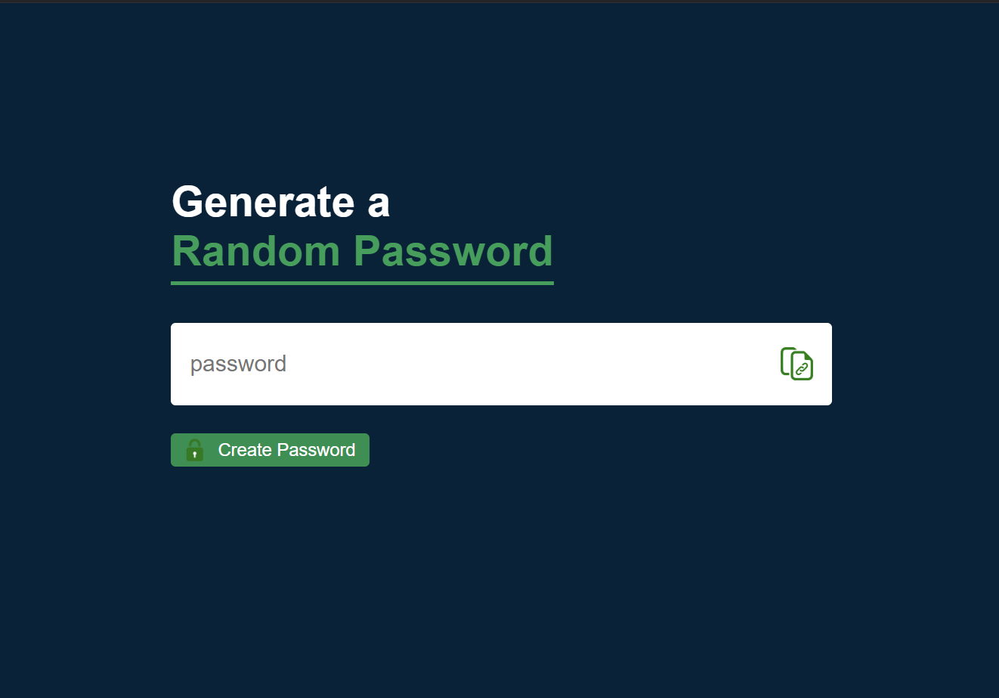
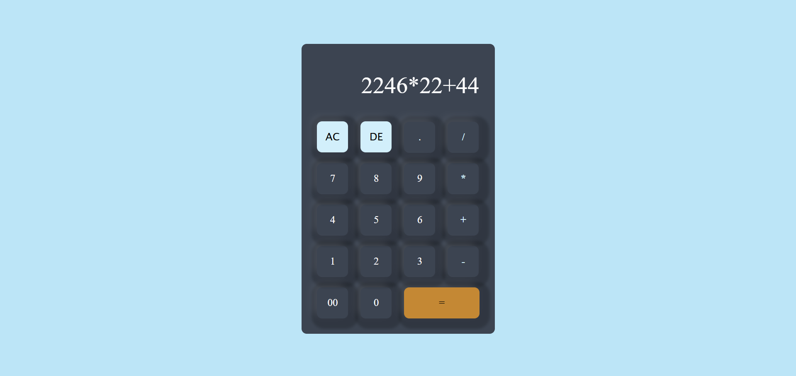

# 🌟 Mini Projects

Welcome to my **mini-projects repository**! This collection showcases simple yet functional projects I built using **HTML**, **CSS**, and **JavaScript** for practice and learning purposes. Each project demonstrates core web development concepts and focuses on creating interactive user experiences.  

---

## 🚀 Projects Included  

### 1️⃣ **Password Creation Tool**  
🔒 **Secure Passwords, Simplified!**  
A user-friendly tool to help you create strong passwords and enhance your account security.  
- **✨ Features**:    
  - Input validation for including **numbers**, **symbols**, and **uppercase letters**.  
  - Modern and responsive design.  
- **🎯 Purpose**: Practice form validation and logic implementation using JavaScript.  



---

### 2️⃣ **Digital Calculator**  
🧮 **Your Basic Calculator, Reinvented!**  
A sleek, functional calculator for basic math operations.  
- **✨ Features**:  
  - Supports **addition**, **subtraction**, **multiplication**, and **division**.  
  - Clean and minimal interface.  
  - **Error handling** (e.g., division by zero).  
- **🎯 Purpose**: Enhance DOM manipulation and event handling skills.



---

### 3️⃣ **Sign In / Sign Up Form**  
📝 **Authentication Made Easy!**  
A responsive and interactive form for user login and registration.  
- **✨ Features**:  
  - Separate **Sign In** and **Sign Up** forms.  
  - Field validation for email, password length, and other criteria.  
  - Smooth transitions with **CSS animations**.  
- **🎯 Purpose**: Explore form validation, CSS styling, and interactivity.  


---

## 🛠️ Technologies Used  
- **HTML** 🧱: For the structure and content.  
- **CSS** 🎨: For styling and responsiveness.  
- **JavaScript** ⚡: For interactivity and logic.  

---

## 📂 How to Use  
1. **Clone this repository**:  
   ```bash  
   git clone https://github.com/Diiips/Mini_Projects
   ```  

2. Navigate to the project folder of your choice.  

3. Open the `.html` file in your favorite browser to view and interact with the project.  

---

### 🌟 **If you like these projects, don’t forget to give this repo a star!** ⭐
